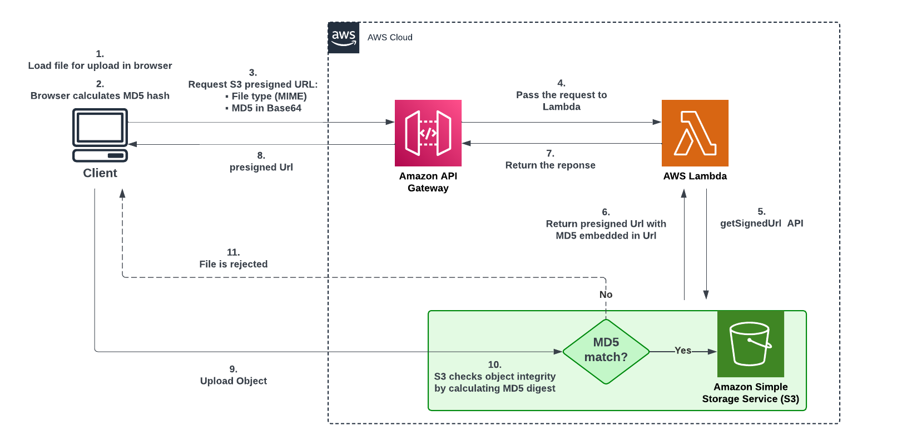

# Securing S3 Presigned URLs for Serverless Applications
Sample serverless application that demonstrates multiple techniques used to secure S3 presigned URLs, including adding a Content-MD5 checksum, expiring URLs dynamically, and generating UUIDs to replace object names.

Please read (the full blog post)[https://aws-future-compute-blog-post-url.com].

## Architecture

## Contributing

We welcome community contributions! Please see [CONTRIBUTING.md](CONTRIBUTING.md) for guidelines.

## Security

See [CONTRIBUTING](CONTRIBUTING.md#security-issue-notifications) for more information.

## License

This library is licensed under the MIT-0 License. See the [LICENSE](LICENSE) file.